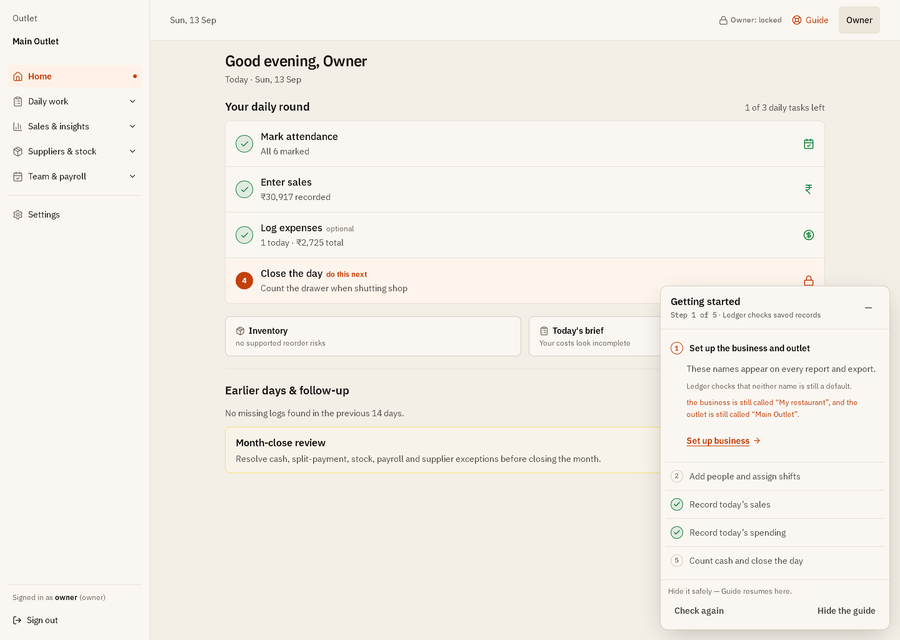
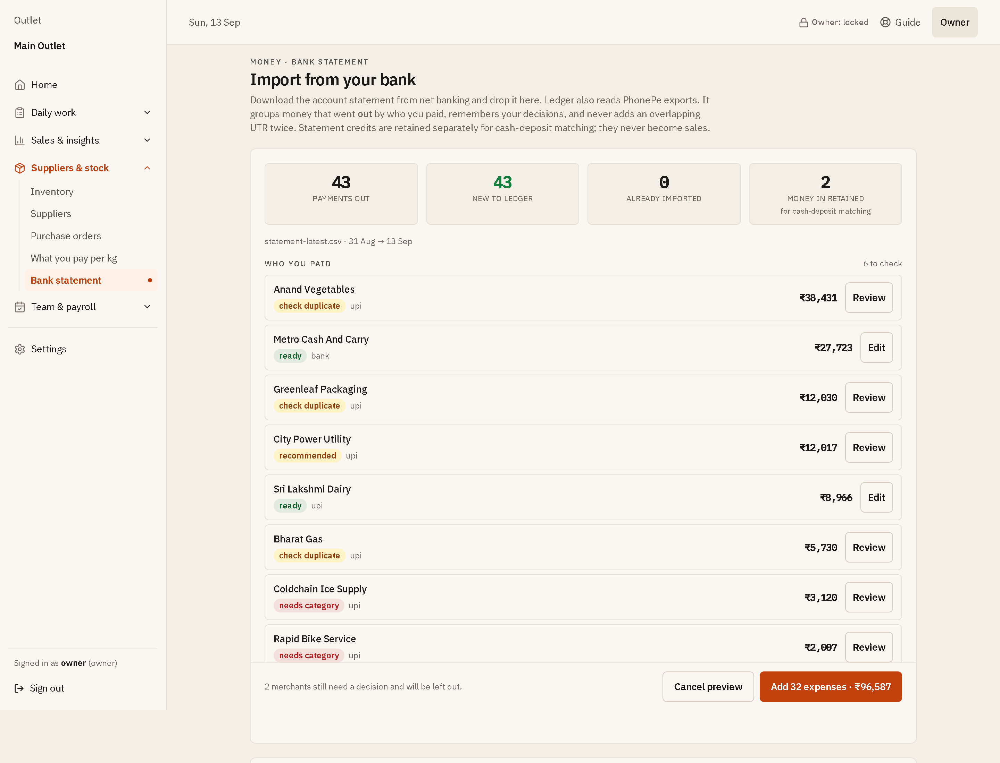

# Ledger — The Counter Book

Ledger is the back office for one small restaurant, running on one PC you own.
It holds the day together in a single register — sales, expenses, vendor khata,
shift-aware attendance, advances, payroll, stock and purchasing — imports
Petpooja bills and bank/PhonePe statements so money-in and money-out line up,
and keeps every record in one file you can copy. No subscription, no internet
needed, and it works from your phone over your own private network.

**Licence: AGPL-3.0.** Free to use, modify and self-host, forever. If you run a
modified copy as a service for other people, you must publish your changes.

## Why Ledger

A shop running on a notebook and three WhatsApp groups does not lose money
dramatically. It loses it quietly: a cash day counted from memory, an expense
paid online and entered again from the bank statement, an advance nobody
subtracted at payroll, stock ordered on a feeling, a month closed with a
"profit" that never counted staff wages. By the time the pattern is visible the
evidence is gone.

Ledger's job is to make the day's record complete enough to trust — and to say
so plainly when it is not. Where it cannot be sure of a number it withholds it
instead of showing a confident green figure: a profit estimate stays grey until
payroll has actually been run, a reorder suggestion stays silent until purchase
and count history supports it, and "no problems found" is never claimed for a
month with nothing recorded in it.

## How a day works

| Step | What happens | Why it matters |
|---|---|---|
| **1. Set up once** | Name the business, add staff, suppliers and stock items in **Settings**. | Everything later is attributed to a real person, vendor or item instead of a free-text note. |
| **2. Attendance** | Mark who is in, on which shift, with lateness and overtime. | Attendance is what payroll, advances and labour cost are computed from — not a guess at month end. |
| **3. Sales** | Enter channel totals, or import Petpooja bills; resolve split payments. | Bill-level imports make hourly and menu evidence possible; manual totals are kept honestly labelled as totals. |
| **4. Spending** | Record expenses with vendor, category, mode and receipt — or import a bank/PhonePe statement. | Costs recorded the same day are what stop a month closing with an overstated profit. |
| **5. Cash close** | Count the drawer against expected cash, move money to bank, note the difference. | A short drawer found today is a conversation; found next month it is only a number. |

An owner adds the parts a manager never sees — payroll, advances, salaries,
month close/reopen, edit approvals beyond the 48-hour window, and data safety.

## See it

These screenshots use Ledger's built-in fictional demo data — no real
restaurant, employee, supplier or customer records. Select a preview to open the
full capture.

### Get from an empty install to a first closed day

Five guided steps, each ticked by records Ledger actually found rather than a
"mark as done" button.

<p align="center">
  <a href="docs/screenshots/14-getting-started.png">
    
  </a>
</p>

### Run the day from one checklist

Attendance, sales, expenses and cash close in one loop, with missed days shown
as catch-up work instead of silent zeroes.

<p align="center">
  <a href="docs/screenshots/01-home.png">
    
  </a>
</p>

### Import a bank statement without booking it twice

Every payee is labelled ready, needs category, or check duplicate before
anything is created, and the commit button names exactly what it will book.

<p align="center">
  <a href="docs/screenshots/13-statement-import-review.png">
    
  </a>
</p>

### See what needs an owner's attention

A ranked brief where every finding carries its evidence, the days it covers, and
a stated confidence level.

<p align="center">
  <a href="docs/screenshots/07-daily-brief.png">
    
  </a>
</p>

### Keep the same daily loop on a phone

The full operating loop on a touch layout that installs to the home screen and
queues entries when the connection drops.

<p align="center">
  <a href="docs/screenshots/12-mobile-home.png">
    
  </a>
</p>

See the [full visual tour](docs/SCREENSHOTS.md) for expenses, cash close, bills
and splits, inventory, purchasing, reports, staffing and owner controls.

## What's newly strong

- **A guide that cannot lie about your progress.** Getting started ticks a step
  only when the matching records exist, so hiding it never loses progress.
- **Bank and PhonePe statements you can trust to import once.** Money out is
  grouped by payee, a hand-entered payment of the same date and amount is
  flagged and excluded by default, and categories are only suggested when your
  own past entries agree.
- **Profit you are allowed to believe.** Month figures are backed by records or
  withheld with the reason named, and month close lists its blockers instead of
  rounding past them.
- **Purchases that only cost you money when goods arrive.** A plan waits for
  approval and an approved order waits for delivery; only a finalised receipt
  moves stock, books the expense and raises the supplier liability.
- **Bill history that stays fast as it grows.** Search and filter thousands of
  imported bills paged from the server, with part-cash/part-online splits
  surfaced as work to finish.
- **Deletion insurance.** Verified recovery archives are written outside
  Ledger's own folder, daily, with a restore helper that checks the archive
  before it touches anything.

Detailed changes are in the [changelog](CHANGELOG.md).

## What it covers

| Area | What it gives a restaurant owner |
|---|---|
| **Daily operation** | One checklist for attendance, sales, expenses and cash close, with catch-up prompts for missed days. |
| **Sales capture** | Manual channel totals, Petpooja bill imports, server-paged bill search, split payments, refunds and losses. Manual totals are never presented as bill-level or hourly fact. |
| **Expense capture** | Vendor, category, payment mode, receipt attachments, bulk line-item bills, and duplicate-checked bank/PhonePe statement import. |
| **Cash and bank control** | Expected-versus-counted drawer cash, explicit money moved to bank, partial many-to-many reconciliation, statement credits kept separate from sales. |
| **Purchasing and payables** | Draft, approve, cancel, receive and finalise orders; only a finalised receipt writes the expense, stock movement and liability. FIFO aging keeps settled bills off the overdue list. |
| **Inventory and recipes** | Stock items, purchases, wastage, physical counts, variance history, confirmed ingredient links, theoretical consumption and evidence-gated reorder drafts. Forecasts never move stock by themselves. |
| **People and payroll** | Shift-aware attendance, lateness and overtime, advances, transparent payroll drafts and finalised payroll controls. Staff planning uses timestamped bills and real attendance. |
| **Reports and analysis** | Month P&L with cost-coverage warnings, break-even, budgets, forecast scenarios, trends, supplier price movement, labour productivity, menu engineering and service-period demand. |
| **Owner intelligence** | A ranked Daily Brief with evidence, confidence, deep links, policy thresholds, resolution history, recurring-cost review, close-readiness exceptions, cash runway and system-health guidance. |
| **Optional AI wording** | An owner-clicked brief can rephrase anonymous aggregate findings. It never receives names, figures, transactions, notes, dates, documents or links, and can never write or decide. |
| **Safety and ownership** | Local SQLite storage, append-only audit history, month close/reopen controls, owner elevation for sensitive edits, offline queues for selected entries, verified backups, phone-friendly interface. |

### The rules behind the numbers

- **Financial truth first:** recorded expenses are not automatically all costs,
  and sales minus recorded expenses is not called profit until coverage makes
  that claim credible.
- **Closed books stay closed:** financial writes to a closed month return a
  clear lock error until an owner deliberately reopens that period.
- **Evidence before advice:** missing recipes, count history, purchase cadence
  or timestamped demand suppresses a recommendation instead of inventing it.
- **Human approval stays in control:** AI is optional and advisory; purchase
  approval, receiving, cash reconciliation, payroll and closing books always
  require a person in Ledger.

### Non-goals (by design)

GST filing (CA-pack exports instead), customer-side khata, aggregator
settlement reconciliation, biometric hardware, and multi-master sync between
two PCs that are both taking entries.

---

## Try it in five minutes

You do not have to enter real data to look around. Start with a demo ledger
full of sample records.

**Docker** (any OS):

```bash
cp .env.example .env          # then set LEDGER_OWNER_PASSWORD
echo "LEDGER_DEMO_SEED=1" >> .env
docker compose up -d
```

**Windows, no Docker:** from PowerShell in a source checkout:

```powershell
$env:LEDGER_OWNER_PASSWORD = "demo-ledger-password"
$env:LEDGER_DEMO_SEED = "1"
.\start.ps1
```

Open <http://localhost:8080> and sign in as `owner` with the password you set
(`demo-ledger-password` for the Windows commands above). Demo data is created
only on a new database; do not set `LEDGER_DEMO_SEED` for a real restaurant.
Remove that line and start from an empty database when you are ready for real
records.

On first use, **My restaurant** is a neutral placeholder. Open
**Settings → Business, money & region** to name the business; that name appears
on the sign-in screen and in the browser tab.

---

## Running it for real

### Windows

#### Installing a fresh Ledger from GitHub

The GitHub checkout now includes the built `web\dist` screen bundle, so a new
PC can install directly from the latest pull or **Code → Download ZIP**:

1. Extract the GitHub ZIP with Windows **Extract All** (or pull the latest
   `main` branch).
2. Open the extracted `Ledger` folder.
3. Double-click `setup\Install-Ledger.cmd`.

Alternatively, download the smaller prebuilt package from GitHub Actions:

1. Open [Actions → Build Windows install package](../../actions/workflows/build-windows-install.yml).
2. Open the newest successful run for `main`, then download
   **Ledger-Fresh-Install** under **Artifacts**.
3. Extract it with Windows **Extract All**, then double-click the top-level
   `Install-Ledger.cmd` beside the `Ledger` folder.

Both paths create a brand-new, empty Ledger. They contain no restaurant
records, receipt images, passwords, or login keys.

#### Moving an existing Ledger to a new PC

On the working Ledger PC, run `setup\Create-Package.cmd` → choose **3** →
transfer the generated `Ledger-New-PC.zip` privately. On the new PC, use
**Extract All**, then double-click the top-level `Install-Ledger.cmd` beside
the `Ledger` folder.

It checks the machine before it changes anything — 64-bit Windows, a usable
Python (and whether python.org is reachable if there is none), free disk space,
write access, and whether port 8080 is already taken. If a check fails it
prints the problem and what to do, and stops without touching your PC.

If every check passes it works out whether this is a first installation or an
update. A first installation asks you to choose an owner password. An update
backs the database up first, replaces only the program, and leaves your
records, uploads and logins alone. Either way it registers Ledger to start when
you sign in, waits until it is actually answering, and opens it in your browser.

These are double-clickable too, because Windows blocks double-clicked
PowerShell files:

| I want to… | Double-click |
|---|---|
| Install or update Ledger | Top-level `Install-Ledger.cmd` (inside the ZIP) |
| Start Ledger | `Start-Ledger.cmd` |
| Stop Ledger | `Stop-Ledger.cmd` |
| Build a package for another PC | `setup\Create-Package.cmd` |
| Permanently clear old local Ledger data | `setup\Remove-Ledger-Data.cmd` |

From a terminal: `.\start.ps1`, `.\stop.ps1`, and
`.\setup\Create-Ledger-New-PC-Package.ps1` with `-Update` or `-Fresh`.

Your records live in `%LOCALAPPDATA%\Ledger\server\data`, separate from the
program, so an update never touches them. To back Ledger up, copy that folder.

#### Starting over on a PC

If this PC shows people, sales, or settings from an earlier Ledger, run
`setup\Remove-Ledger-Data.cmd` from the downloaded Ledger folder. It lists
what it found and requires you to type `ERASE` before it stops Ledger and
permanently deletes its local records, uploads, login key, old installation
copies, startup tasks, and Ledger recovery archives. The downloaded folder
remains, ready for `setup\Install-Ledger.cmd`.

It does **not** delete unrelated files in a custom backup folder or uninstall
NetBird/Caddy. Copy any records you intend to keep before confirming.

### Docker (Linux, macOS, Windows, or a NAS)

Docker is the only thing you need — no Node, no Python, no build tools, and no
need to clone this repository. Pick a strong password and run:

```bash
docker run -d --name ledger \
  -p 127.0.0.1:8080:8080 \
  -v ledger-data:/data \
  -e LEDGER_OWNER_PASSWORD='choose-a-long-password' \
  --restart unless-stopped \
  ghcr.io/bhardeshirish/ledger:latest
```

Then open <http://localhost:8080>. Images are published for **linux/amd64 and
linux/arm64**, so the same command works on an Intel or Apple Silicon Mac, a
Linux box, or a Raspberry Pi left running in the shop.

Prefer a file you can edit? Clone the repo and use compose instead — this
builds the image locally, which does need an internet connection the first
time:

```bash
cp .env.example .env          # LEDGER_OWNER_PASSWORD is required
docker compose up -d
```

#### Moving it to a machine with no internet

Export the image to a file, carry it over on a USB stick, and load it there.
The target machine needs Docker and nothing else:

```bash
# on a machine that has the image
docker save ghcr.io/bhardeshirish/ledger:latest | gzip > ledger-image.tar.gz   # ~115 MB

# on the target machine
gunzip -c ledger-image.tar.gz | docker load
docker run -d --name ledger -p 127.0.0.1:8080:8080 \
  -v ledger-data:/data -e LEDGER_OWNER_PASSWORD='choose-a-long-password' \
  --restart unless-stopped ghcr.io/bhardeshirish/ledger:latest
```

Records live in the `ledger-data` volume, not in the image, so replacing or
upgrading the container never touches your data. To take a copy off the
machine:

```bash
docker cp ledger:/data ./ledger-backup
```

The image runs as a non-root user (uid 10001) and only needs `/data` to be
writable. CI builds it, pushes it, then pulls the published image back down
and fails the run unless it actually serves the app. `docker compose` refuses
to start at all if `LEDGER_OWNER_PASSWORD` is missing or too short — better a
loud restart loop than a box on the internet with a weak password.

---

## Using it from your phone

The interface is fully responsive — a bottom tab bar, a hidden sidebar, and
touch-sized controls — and it installs to the home screen as an app. There is
no separate Ledger mobile client; private remote access uses the VPN companion
described below.

**It must be served over HTTPS.** This is not a preference. Browsers only grant
offline storage and installability to a *secure context*, so a plain
`http://192.168.x.x:8080` address gives you a website that breaks the moment
the Wi-Fi drops. Worse, it sends your payroll and your password across the café
network in the clear.

**Away from the restaurant, without a paid service or a domain:** use the
[private-access setup guide](docs/REMOTE-ACCESS.md). The recommended Windows
route is **NetBird Free + Caddy private HTTPS**: up to five users and 100
devices under the currently published plan. Install the NetBird companion app
on the phone and trust the Ledger PC's private HTTPS certificate authority
once. Ledger itself is still a browser app. The PC must remain on and online.

On a new restaurant PC, install or move Ledger first, then run one bootstrap
command. It checks the loopback Ledger service, gets stock Caddy from its
official source, and starts NetBird enrollment only when necessary; it does
not make Ledger reachable:

```powershell
.\setup\Set-LedgerRemoteAccess.ps1 -Action Bootstrap -OwnerAuthorized
```

You still sign in to your own NetBird account, create a narrow approved-device
policy, approve the normal Windows firewall rule, and trust the public
certificate on each phone/laptop. Those controls are intentionally not
automated. Follow the guide to finish private HTTPS and optionally enable
startup at Windows sign-in.

**Tailscale Personal is not free for this commercial restaurant use.** Its
current terms limit Personal to non-commercial use. Cloudflare Zero Trust
Free is another business-capable option for up to 50 users, but private WARP
access still needs account enrollment and proper browser HTTPS; it does not
fix a blocked login. The guide compares both and links their official terms.

Do not expose port 8080, enable `-Lan`, forward router ports, or click through
certificate warnings to get remote access working. Internet access and power
still cost money; these free service plans are not an uptime guarantee.

### When the connection drops

Ledger keeps working. You stay signed in, an amber banner tells you the figures
on screen may be stale, and new **sales, expenses and attendance** are saved on
the device and sent when you reconnect. A chip in the corner shows how many
entries are waiting and lets you retry by hand.

Only entries that are safe to re-send are queued this way. Each carries a
unique key, and every endpoint behind it either overwrites one specific day's
figure or refuses a repeated key outright — so an entry that syncs twice is
still recorded once. `server/tests/test_offline_replay.py` is what holds that
promise in place; if you add an endpoint to `OFFLINE_OK` in
`web/src/api/client.ts`, add it there too.

Reading old reports offline is deliberately *not* supported. A cached figure
that is quietly a week out of date is more dangerous than an error message.

---

## Your data

The active records live in `%LOCALAPPDATA%\Ledger\server\data` (Windows,
once installed), `server\data` (when you run it from the source folder), or
the `ledger-data` volume (Docker). That folder holds `ledger.db`, uploaded
receipts, and the signing key that keeps existing sessions valid.

On Windows, Ledger also creates a **verified full recovery ZIP** on first
start and then daily in `%USERPROFILE%\Documents\Ledger Backups`. Each copy
contains the database, receipts and signing key, and the newest 30 daily
copies are retained. This folder is deliberately outside
`%LOCALAPPDATA%\Ledger`: deleting the entire Ledger application folder does
not delete the recovery copies. Open **Settings → Data safety** to see the
exact recovery folder and latest completed copy.

If the Ledger folder is deleted, reinstall Ledger, then run the installed
recovery helper against the newest ZIP:

```powershell
Set-Location "$env:LOCALAPPDATA\Ledger"
.\setup\Restore-LedgerBackup.ps1 `
  -BackupPath "$env:USERPROFILE\Documents\Ledger Backups\ledger-recovery-YYYY-MM-DD.zip" `
  -OwnerAuthorized -ConfirmRestore
```

The helper validates the ZIP and SQLite database before it stops Ledger,
preserves any current data in `Documents\Ledger Backups\before-restore-*`,
then starts Ledger after restoring. Do not extract a backup over a running
Ledger data folder or drop the ZIP into it.

These recovery ZIPs protect against accidental deletion of Ledger's
application folder—not disk failure, theft, fire, ransomware, or deletion of
the entire Windows user profile. Keep an occasional encrypted copy on a
separate device you control. For Docker, set `LEDGER_RECOVERY_DIR` to a
separately mounted backup volume if you need this same separation.

### Private cloud copy with Google Drive

Do **not** use Google Sheets as a database backup. It cannot preserve the
complete SQLite database, receipt files or recovery metadata, and spreadsheet
imports can change data formats. Instead, install
[Google Drive for desktop](https://support.google.com/drive/answer/10838124),
sign in to the restaurant-controlled Google account, and create a private
`Ledger Backups` folder in Drive. Google documents that ordinary local files
in that folder are synchronized to Drive; its current free Google Account
storage allowance is up to 15 GB, shared with Gmail and Photos.

In **Settings → Data safety**, paste that folder's actual File Explorer path
(for example `G:\My Drive\Ledger Backups`) into **Cloud or external recovery
folder**, then choose **Use this recovery folder** and enter the owner
password when prompted. Ledger verifies it is writable, writes a complete
recovery ZIP immediately, and keeps writing daily ZIPs there. It never asks
for, stores, or sends a Google password, OAuth token, or Google API key.

Check Google Drive for desktop's sync status after the first backup. Treat the
Drive account as part of the restaurant's security boundary: enable MFA, do
not share the folder publicly, and make sure the account's remaining storage
comfortably exceeds the backup size.

### Moving to a new Windows PC

Run `.\setup\Create-Ledger-New-PC-Package.ps1` on the old PC. It stops Ledger,
then builds `Ledger-New-PC.zip` with a consistent database snapshot, the
receipts and the application. Transfer that ZIP privately, extract the whole
of it on the new PC, and double-click the top-level `Install-Ledger.cmd` beside
the `Ledger` folder — not the similarly named file under `setup`. A GitHub
download or copied project folder cannot install on its own because it excludes
the built `web\dist` files. Do not resume entering data on the old PC
afterwards; the two databases do not synchronise.

`-Fresh` builds `Ledger-Fresh-Install.zip` instead, carrying no records at all.

If you would rather copy by hand, quit Ledger on both PCs and copy three
things out of the data folder:

* `ledger.db` — every record you have
* the `uploads` folder — your receipt photographs, which are **not** inside
  the database and are silently lost if you forget them
* `secret.key` — optional. Bringing it keeps you signed in; leaving it behind
  only means signing in again. Your password works either way.

### Updating a PC that already runs Ledger

Run `.\setup\Create-Ledger-New-PC-Package.ps1 -Update` to build
`Ledger-Update.zip` (program only, no records). Extract the whole ZIP on the
target PC, double-click `Install-Ledger.cmd`, then press Ctrl+F5 in the
browser. The same script installs and updates; it recognises a PC that already
runs Ledger and switches to updating by itself.

That PC keeps its own database, receipts and logins. Before replacing anything
it backs the database up to a `backups` folder beside it, verifies that backup opens,
keeps the previous program alongside for rollback, and refuses to run against a
package that carries a database of its own.

---

## Security

- Managers never see salaries, payroll or advances at all.
- Editing a record older than 48 hours (configurable) needs the owner's live
  password.
- Sessions are database-backed, so signing out revokes access immediately;
  cookie writes are CSRF-protected; repeated bad passwords lock the account.
- Every change lands in an append-only audit log.
- Ledger binds to `127.0.0.1` unless you explicitly tell it otherwise.

Found a security problem? Please report it privately through a GitHub security
advisory rather than a public issue.

---

## Contributing

```bash
cd server && python -m pip install -r requirements.txt -r requirements-dev.txt
export LEDGER_OWNER_PASSWORD='choose-a-strong-password'
uvicorn app.main:app --reload --port 8000          # API + /api/docs
cd ../web && npm install && npm run dev            # SPA on 5173, proxies /api
```

Before opening a pull request, run these checks from the repository root:

```bash
(cd server && python -m pip install -r requirements.txt -r requirements-dev.txt && python -m pytest -q)
(cd web && npx vitest run && npx tsc --noEmit && npx eslint src)
```

Two house rules, both learned the hard way:

1. **A test you have not watched fail proves nothing.** Break the code on
   purpose, see the new test go red, then put the code back.
2. **Never show a confident number the data does not support.** If a figure is
   missing an input, name the input.
