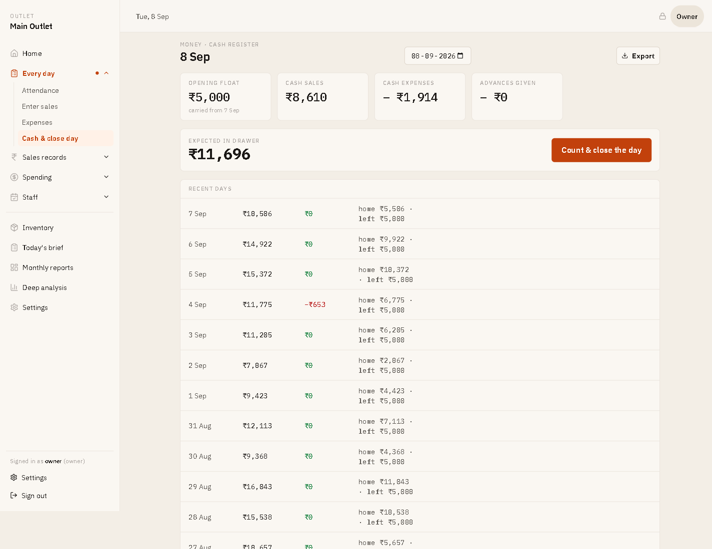
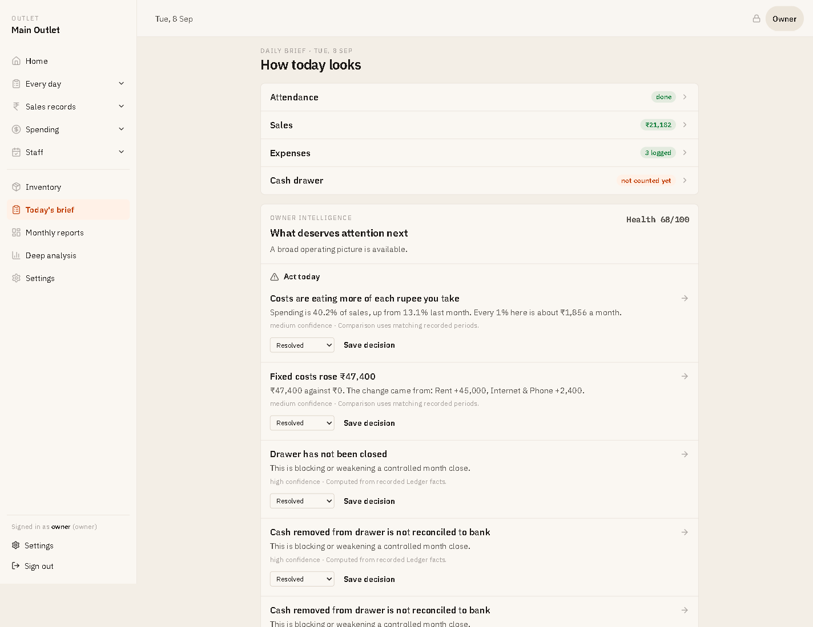
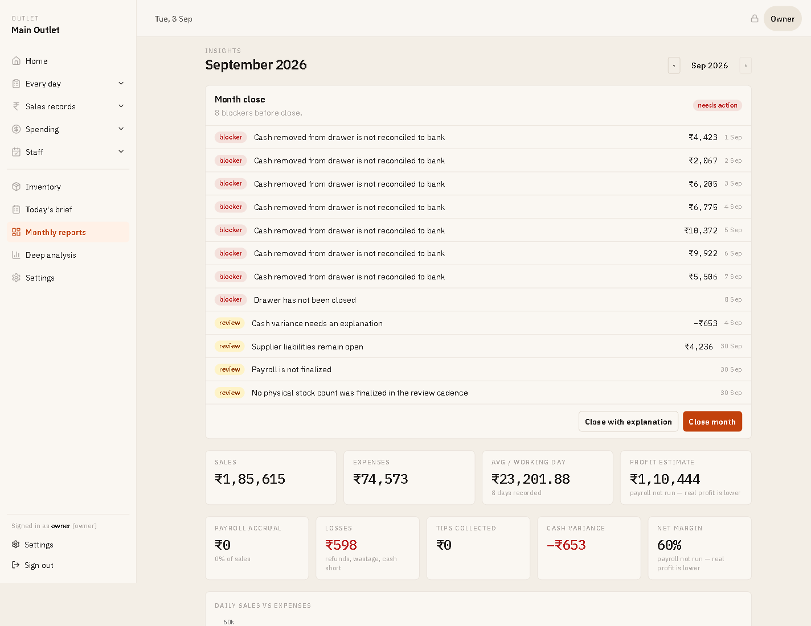
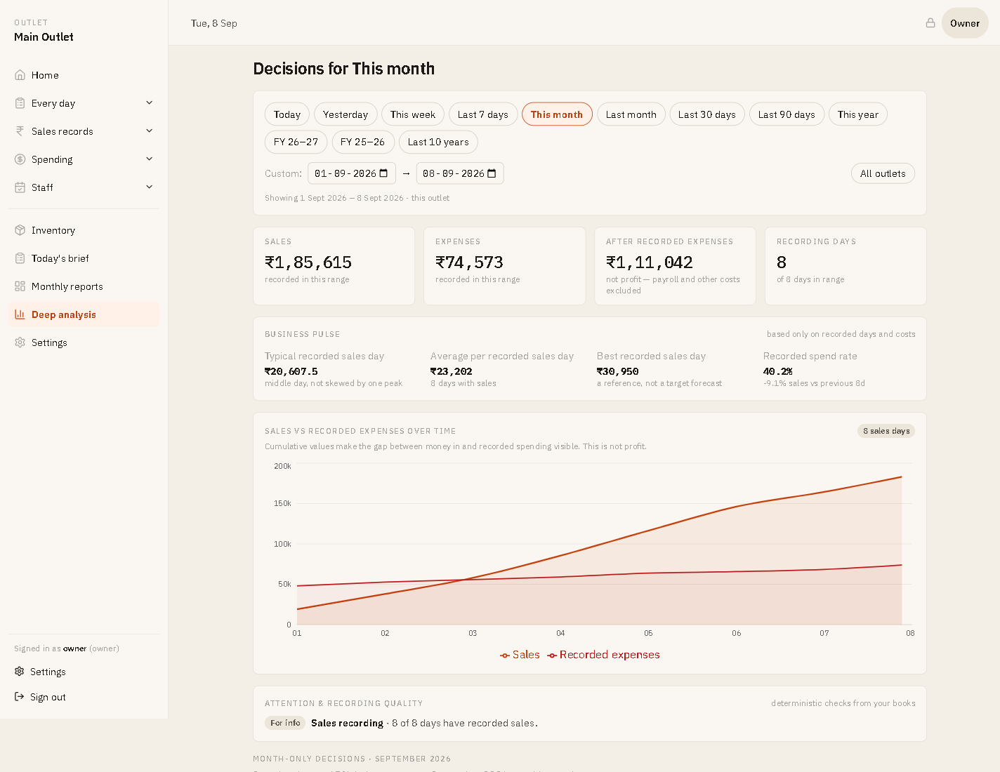
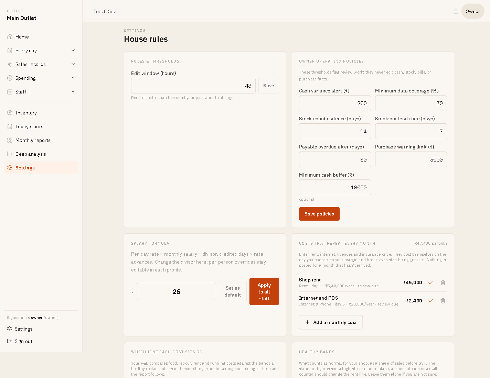

# Ledger visual tour

Every capture below is from an isolated, fictional demo ledger. No real
restaurant, supplier, employee, transaction, receipt, or login data is shown.

The previews are sized for reading in GitHub. Select any image to open the
complete capture at full resolution.

## Keep today under control

### Daily checklist

One clear daily loop for attendance, sales, expenses, and cash close.

  

### Expense capture

Record expenses with historical context instead of losing receipts and
supplier costs in a chat thread.

  

### Cash close

Compare the expected drawer against the count, then record an explicit cash
movement. [Open the complete cash-close screen.](screenshots/03-cash-close.png)

  

## Order with evidence

### Inventory risks

See quantity, cover, and order context before deciding what needs attention.

  

### Reorder evidence

Recommendations remain separate from the missing data that would make a
recommendation unsafe.

  

### Purchase controls

Plans await approval; only a finalized receipt affects expenses, stock, and
supplier liabilities.

  

## Turn records into owner decisions

### Daily Brief

Ranked owner actions show their evidence and confidence. [Open the complete
Daily Brief.](screenshots/07-daily-brief.png)

  

### Monthly reports

Close readiness, forecasts, recurring-cost reviews, and reporting controls
share one decision surface. [Open the complete monthly-reports screen.](screenshots/08-monthly-reports.png)

  

### Deep analysis

Sales, cost, supplier, demand, menu, and labour evidence connect to the same
financial truth. [Open the complete deep-analysis screen.](screenshots/09-deep-analysis.png)

  

### Staffing

Service-period demand and actual attendance guide staffing decisions.

  

## Make control durable

### Owner controls

Per-outlet policies, resilience status, and restore guidance protect the
system when a restaurant is busiest. [Open the complete owner-controls
screen.](screenshots/11-owner-controls.png)

  

### Mobile checklist

The operating loop remains focused and usable during service on a phone.

  

