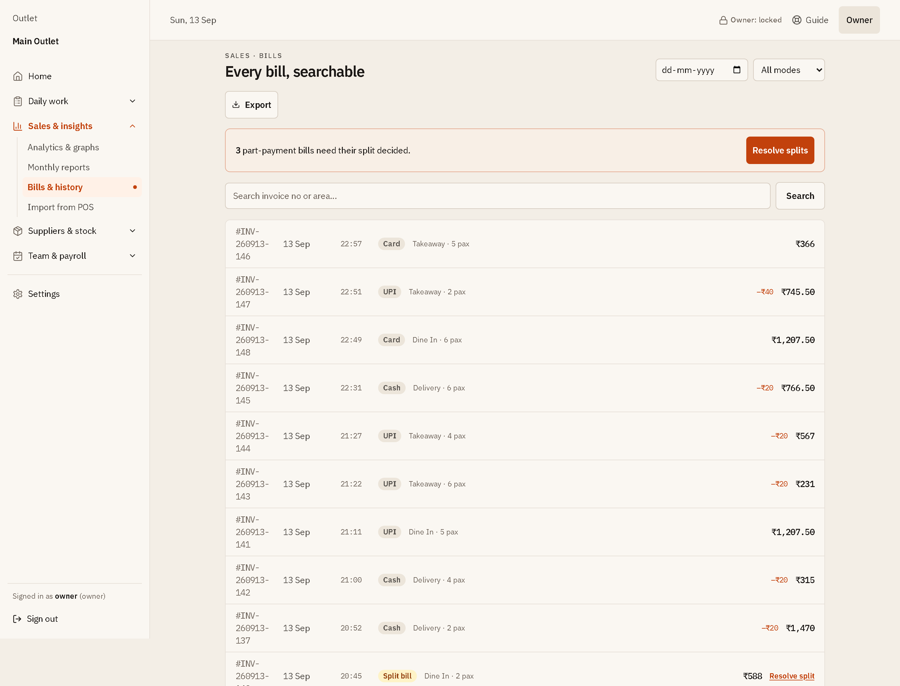
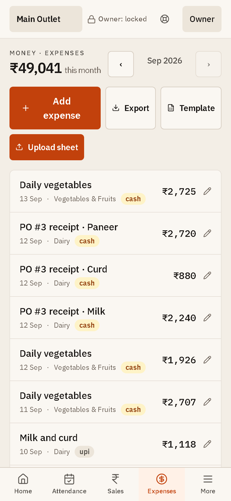

# Ledger visual tour

Every capture below is from an isolated, fictional demo ledger seeded with
invented staff, suppliers, bills, and bank lines. No real restaurant, person,
supplier, customer, transaction, receipt, or credential appears anywhere in
these images.

Previews are sized for reading on GitHub. Select any image to open the complete
capture at full resolution.

## Start here

### Getting started

Five steps take a new install from empty to a first closed day: name the
business, put people on shifts, record sales, record spending, count the cash.
Each step is ticked by **records Ledger actually found** — there is no "mark as
done" — so hiding the guide cannot lose progress, and a step that is still
loading says *checking* rather than claiming the work is undone.

  

## Keep today under control

### Daily checklist

One clear daily loop for attendance, sales, expenses, and cash close. The guide
collapses to a *Step N of 5* pill once you are working.

  

### Expense capture

Record spending with vendor, category, and payment mode in one pass, with the
recent history beside the form so a duplicate entry is visible before it is
made.

  

### Cash close

Opening float, cash sales, cash expenses, and advances add up to one expected
drawer figure. Bills that were paid part cash and part online are shown as an
explicit unknown (`? ₹1,890`) instead of being guessed into the drawer.
[Open the complete cash-close screen.](screenshots/03-cash-close.png)

  

## Bring records in without breaking them

### Bank / PhonePe statement review

Upload a statement and Ledger groups money out by who was paid, then labels
every payee before anything is booked: **ready**, **needs category**, or
**check duplicate** when a payment of the same date and amount was already
entered by hand. Duplicates are excluded by default. Categories come from your
own history — a suggestion appears only when past entries for that payee agree
— and a confirmed payee can be remembered for next time. The commit button
names exactly how many expenses will be created and for how much.
[Open the complete import-review screen.](screenshots/13-statement-import-review.png)

  

### Bills & history

Every imported bill is searchable and paged from the server, with filters by
date and payment type and an honest *Showing X–Y of Z*. Bills paid across two
methods are surfaced as work to do: the split must be allocated across channels
and must add up to the bill total exactly.
[Open the complete bills screen.](screenshots/15-bills.png)

  

## Order with evidence

### Inventory

Quantity, usage, and food cost in one place — and a count of items whose
evidence is being **withheld** rather than dressed up as safe stock.

  

### Reorder evidence

A reorder recommendation appears only when the recorded inputs support it.
Everything else is listed as missing data to fix, not as a silent "healthy".

  

### Purchase controls

A plan waits for approval, an approved order waits for goods, and **only a
finalized receipt** moves stock, creates the expense, and raises the supplier
liability.

  

## Turn records into owner decisions

### Daily brief

Ranked owner actions, each with the evidence behind it, the days it covers, and
a stated confidence level. Repeated findings collapse into one decision instead
of a month of identical rows. [Open the complete daily brief.](screenshots/07-daily-brief.png)

  

### Monthly reports

Month close lists its blockers by name — unreconciled cash, an unclosed drawer,
an unresolved payment split — and a month can only be closed over them with a
written explanation. Profit is withheld, with the reason, whenever the cost side
is not complete enough to state one.
[Open the complete monthly-reports screen.](screenshots/08-monthly-reports.png)

  

### Deep analysis

Sales, cost, supplier, demand, menu, and labour evidence lead to ranked next
actions — *Act on this*, *Check this*, *Record this* — each with the arithmetic
shown and a **Before you act** note naming the innocent explanation (a bulk buy,
a double entry, a closed day) before you chase a trend.
[Open the complete deep-analysis screen.](screenshots/09-deep-analysis.png)

  

### Staffing

Coverage, labour effectiveness, and observed service periods. Suggestions are
explicitly *review candidates, never a generated roster or a judgement about a
person*, and are withheld when no repeatable pattern clears the evidence bar.

  

## Make control durable

### Owner controls

Per-outlet policies, edit windows, and data safety in one place: where the
verified recovery copies are written (outside Ledger's own folder), when the
last one completed, and a one-click download of the full archive.
[Open the complete owner-controls screen.](screenshots/11-owner-controls.png)

  

## On a phone

### Daily checklist

The operating loop stays focused during service, with a five-tab bottom bar and
touch targets sized for a busy counter.

  

### Expenses on the floor

Spending is captured where it happens. Writes are queued if the connection drops
and retried with an idempotency key, so a flaky network cannot book the same
expense twice.

  

